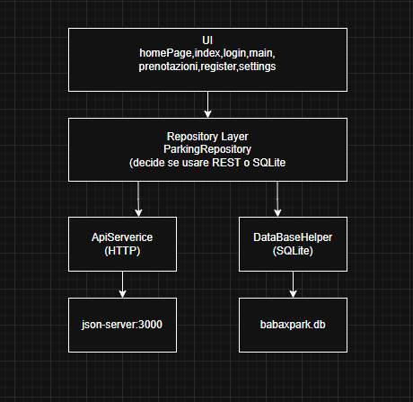
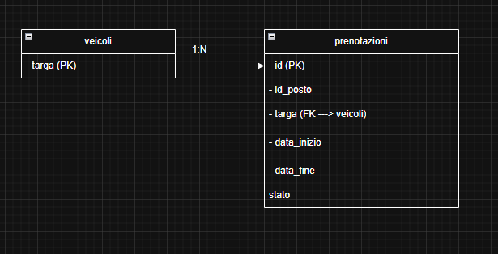

## Descrizione del Progetto BabaxPark

BabaxPark è un'app Flutter per la prenotazione di posti auto in un parcheggio privato con **14 posti** (due file da 7, denominati A1–A14). L'app è multiutente, offre la prenotazione di slot orari, visualizzazione delle proprie prenotazioni e una mappa grafica del parcheggio.

---

## Architettura

L'applicazione segue un'architettura a livelli:



---

## Scelte Progettuali

### 1. Backend con json-server
 `json-server` come backend REST simulato per semplicità di configurazione e sviluppo. Il file `server/db.json` funge da database del server.

### 2. SQLite come cache locale
Tramite `sqflite`, tutti i dati scaricati dal server vengono salvati localmente. 

### 3. Pattern Repository
Il `ParkingRepository` centralizza tutta la logica di accesso ai dati. Le pagine  non comunicano mai direttamente con le API o il database, ma sempre tramite il repository. Ho optato per questa scelta per un miglior testing del codice e per sistemare eventuali errori.

### 4. Sessione Utente (Singleton)
`SessioneUtente` è implementato come **Singleton**: esiste una sola istanza durante l'esecuzione dell'app.

### 5. Autenticazione con BCrypt
Le password vengono **hashate con BCrypt** prima di essere salvate sul server. Al login, la password inserita viene verificata contro l'hash salvato tramite `BCrypt.checkpw()`.

### 6. Validazione Prenotazioni
Sono presenti due livelli di validazione (client) prima di inviare la prenotazione al server:
- **Disponibilità del posto**: controlla se il range orario selezionato si sovrappone a prenotazioni esistenti per quel posto, usando confronto `DateTime` (gestisce correttamente i turni che attraversano la mezzanotte).
- **Unicità targa per data**: impedisce alla stessa targa di effettuare più di una prenotazione nella stessa data.

### 7. Calcolo data di fine con DateTime
Ho optato per un calcolo basato su `DateTime` per risolvere il problema della prenotazione oltre la mezzanotte..

### 8. Widget Riutilizzabili
Nella cartella widget, utilizzati nella register.dart e login.dart
- `CustomButton`: pulsante con stile
- `CustomTextField`: campo di testo con icona e stile   
- `HeaderText`: titolo + sottotitolo 

### 9. Mappa del Parcheggio con CustomPainter
La mappa del parcheggio è disegnata tramite API `CustomPainter`.

---
## Struttura del Progetto

```
babaxpark/
├── assets/                       
│   ├── icon/                      
│   └── images/                    
├── server/
│   └── db.json                     
├── lib/
│   ├── main.dart                   
│   ├── homePage.dart              
│   ├── login.dart                 
│   ├── register.dart              
│   ├── index.dart                 
│   ├── prenotazioni.dart          
│   ├── settings.dart              
│   ├── models/
│   │   ├── prenotazione.dart     
│   │   └── veicolo.dart          
│   ├── services/
│   │   ├── api_service.dart      
│   │   └── sessione_utente.dart  
│   ├── repositories/
│   │   └── parking_repository.dart 
│   ├── database/
│   │   └── database_helper.dart  
│   └── widgets/
│       ├── custom_button.dart     
│       ├── custom_text_field.dart 
│       ├── header_text.dart       
│       └── parking_map.dart       
├── image.png                      
└── pubspec.yaml                 
```

---

## Schema Database

### SQLite (Cache locale)
```sql
CREATE TABLE veicoli (
  targa TEXT PRIMARY KEY
);

CREATE TABLE prenotazioni (
  id          TEXT PRIMARY KEY,
  targa       TEXT NOT NULL,
  id_posto    INTEGER NOT NULL,
  data_inizio TEXT NOT NULL,
  data_fine   TEXT NOT NULL,
  stato       TEXT NOT NULL,
  FOREIGN KEY (targa) REFERENCES veicoli (targa)
);
```

### Server (json-server)

- **Tabella `utenti`**: `id`, `username`, `email`, `password`.
- **Tabella `veicoli`**: `targa`.
- **Tabella `prenotazioni`**: `id`, `targa`, `id_posto`, `data_inizio`, `data_fine`, `stato`.

### Diagramma Relazioni




> **Nota:** la tabella `utenti` esiste solo sul server json-server per motivi di sicureza. I dati dell'utente vengono tenuti in memoria dalla classe `SessioneUtente` per tutta la durata della sessione.

---

## Diario di Progetto (Step di Sviluppo)

### Step 1: Setup Grafico e Struttura UI
Il primo passo è stato definire l'identità visiva dell'app. Ho scelto una **Dark Mode** con colori a contrasto (Arancione Babax e Verde Parcheggio). In questa fase ho strutturato la navigazione principale tramite la **`BottomNavigationBar`**, suddividendo l'app nelle tre sezioni chiave: Index (stato), Prenotazioni e Impostazioni. Questo ha permesso di avere fin da subito una struttura solida per poi lavorare sulle logiche successive.

### Step 2: Il Problema della Mezzanotte 
Questo è stato lo step più divertente ma allo stesso tempo intricato. Inizialmente il calcolo della durata occupata era basato sui minuti totali, ma questo sistema falliva completamente per le prenotazioni a cavallo della mezzanotte (es. dalle 23:00 alle 02:00). 
- **Soluzione**: Abbiamo affinato il calcolo basato sui **minuti totali** utilizzando l'operatore modulo 24 (`% 24`) per gestire correttamente l'orario di fine. Per quanto riguarda invece la validazione della targa e il salvataggio dei dati, abbiamo sfruttato gli oggetti `DateTime` per garantire la precisione delle date.

### Step 3: Architettura e Pattern Repository
La scelta iniziale è stata il **Pattern Repository**: ho deciso di non far comunicare le pagine direttamente con il server, ma di passare per (`ParkingRepository`) che funge da mediatore. Ho visionato diversi video su YouTube che optavano per questo modus operandi.

### Step 3: Integrazione REST e Cache Offline
Abbiamo scelto `json-server` per semplicità d'uso. Ho implementato un sistema di cache con SQLite gestito tramite blocchi **try-catch**: l'app tenta la chiamata API e, se intercetta un errore di rete (come una `SocketException`), esegue in automatico il recupero dei dati direttamente dal database locale. Questo garantisce che l'utente possa sempre vedere le sue prenotazioni, anche senza connessione.

### Step 3: Sicurezza e Validazione Dati
È stato implementato **BCrypt** per l'hashing delle password lato client. La sfida tecnica maggiore qui è stata la **validazione asincrona**: ho recuperato i dati dal server integrando la logica `DateTime` per garantire l'univocità della targa.

### Step 4: Il Problema della Mezzanotte 
Questo è stato lo step più divertente ma allo stesso tempo intricato. Inizialmente il calcolo della durata occupata era basato sui minuti totali, ma questo sistema falliva completamente per le prenotazioni a cavallo della mezzanotte (es. dalle 23:00 alle 02:00). 
- **Soluzione**: Abbiamo affinato il calcolo basato sui **minuti totali** utilizzando l'operatore modulo 24 (`% 24`) per gestire correttamente l'orario di fine. Per quanto riguarda invece la validazione della targa e il salvataggio dei dati, abbiamo sfruttato gli oggetti `DateTime` per garantire la precisione delle date.

### Step 6: Visualizzazione Mappa con CustomPainter
Implementata tramite video tutorial online. Questa parte non è stata particolarmente difficile da implementare.

---

## Link e Risorse Utili

- **Mappa CustomPainter**: [YouTube Tutorial](https://www.youtube.com/watch?v=9G7nYjaXnIA)
- **API Canvas**: [Documentazione Flutter](https://api.flutter.dev/flutter/dart-ui/Canvas-class.html)
- **GestureDetector (Horizontal Scroll)**: [AppOverride Guide](https://www.appoverride.com/flutter-horizontal-scroll-in-list/)
- **BottomNavigationBar**: [Documentazione Ufficiale](https://api.flutter.dev/flutter/material/BottomNavigationBar-class.html)
- **Pacchetto HTTP**: [Pub.dev](https://pub.dev/packages/http)
- **Criptazione Password**: [BCrypt su GitHub](https://github.com/patrickfav/bcrypt/)
- **Scroll Refresh Fix**: [StackOverflow](https://stackoverflow.com/questions/74319835/flutter-how-to-combine-alwaysscrollablescrollphysics-with-clampingscrollphys)